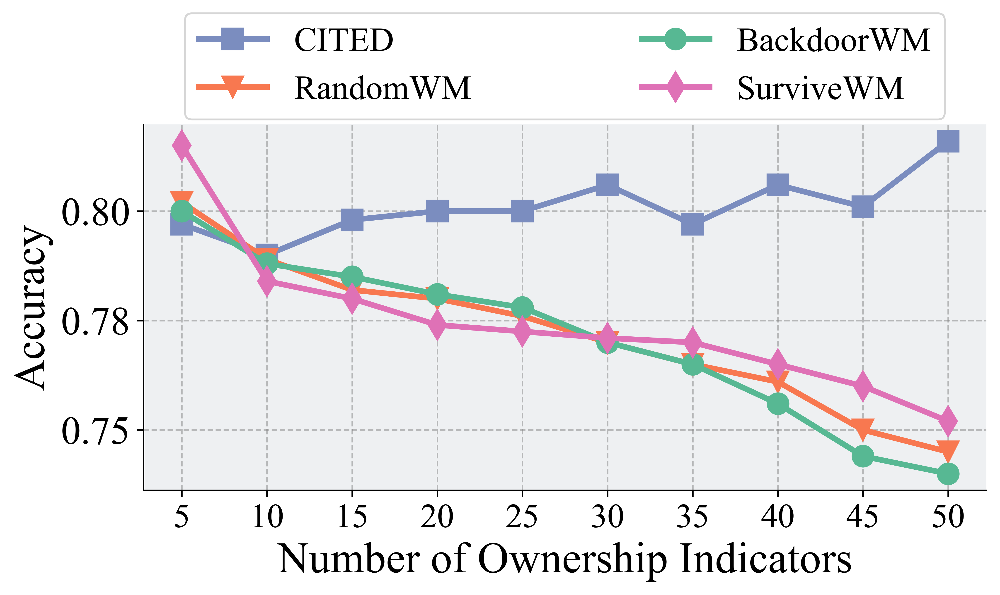
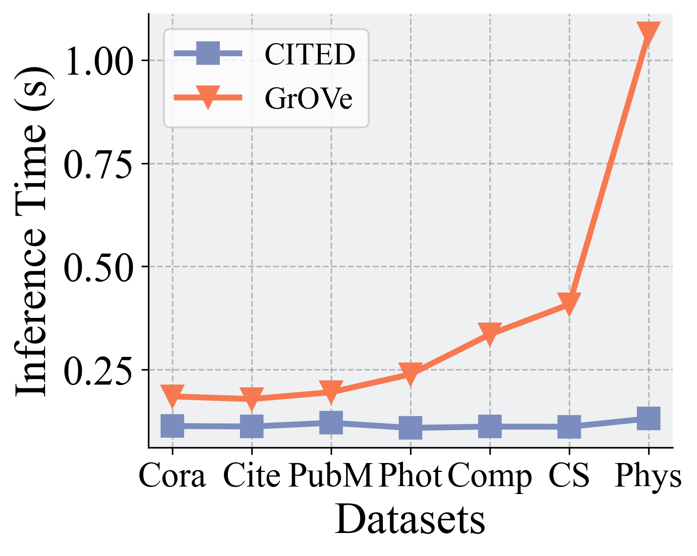
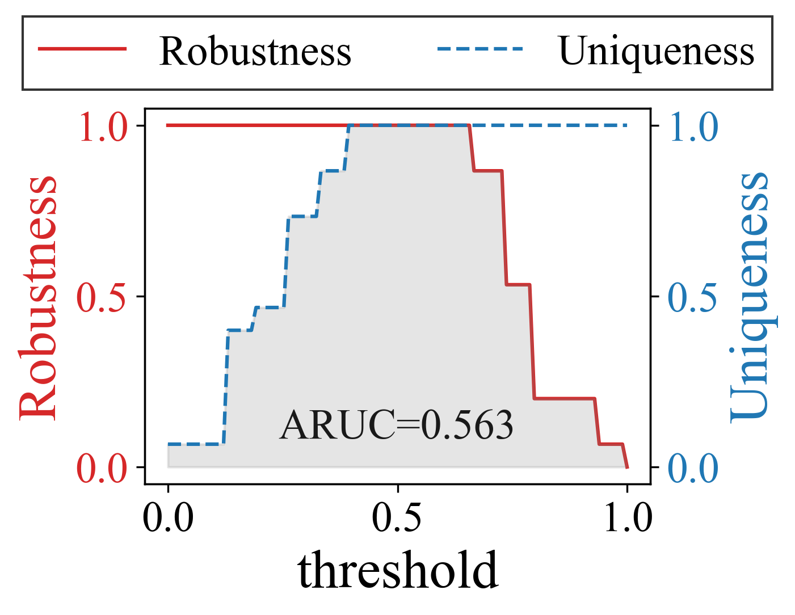

# CITED

## Quick Start

Using `uv` to install the environment
```sh
uv sync
```

## Run Experiments


**Evaluation on Original Task**

Before running the script, please manually update:  
- `exp1.py`: adjust experiment settings (e.g., dataset, model, evaluation level).  
- `utils/config.py`: modify necessary hyperparameters for training and finetuning.  

Ensure the configurations reflect your desired setup.  

Execute the following command:
```sh
python exp1.py
```

Output Example:
```
========== Trial 1 ==========
model load:  ./output/target/Pubmed_GraphSAGE.pth
[Defense] Test Acc: 0.7900 | F1: 0.7801 | AUROC: 0.9260
[Defense]>>>>>>>>>>>>>>>>>>>>>Signature Acc: 1.0000
Defense Model saved to ./output/defense/Pubmed_GraphSAGE_CITED.pth

========== Trial 2 ==========
model load:  ./output/target/Pubmed_GraphSAGE.pth
[Defense] Test Acc: 0.7940 | F1: 0.7844 | AUROC: 0.9270
[Defense]>>>>>>>>>>>>>>>>>>>>>Signature Acc: 1.0000
Defense Model saved to ./output/defense/Pubmed_GraphSAGE_CITED.pth

========== Trial 3 ==========
model load:  ./output/target/Pubmed_GraphSAGE.pth
[Defense] Test Acc: 0.7910 | F1: 0.7811 | AUROC: 0.9269
[Defense]>>>>>>>>>>>>>>>>>>>>>Signature Acc: 1.0000
Defense Model saved to ./output/defense/Pubmed_GraphSAGE_CITED.pth

========== Summary ==========
ACC: 79.17 ± 0.17
F1-score: 78.19 ± 0.18
AUROC: 92.66 ± 0.05
```

Results will be saved automatically to the `results` directory.


**Performance of Ownership Verification**

Before running the script, please manually update:  
- `exp2.py`: adjust experiment settings (e.g., dataset, model, evaluation level).  
- `utils/config.py`: modify necessary hyperparameters for training and finetuning.  

Ensure the configurations reflect your desired setup.  

Execute the following command:
```sh
python exp2.py --defense CITED --data cora --device 0
```

Output Example:
```
[Result - Trial 1] ARUC = 0.3993, AUC = 0.7733
[Result - Trial 2] ARUC = 0.4780, AUC = 0.9733
[Result - Trial 3] ARUC = 0.3460, AUC = 0.8933
Experiment Configuration: level=label | variant_num=15 | model_name=gcn2 | hidden_dim=128 | train_epochs=200 | lr=0.001 | weight_decay=1e-05 | query_ratio=0.5 | fixed_seed=42 | device=cuda:0 | defense_name=CITED | cited_boundary_ratio=0.05 | cited_signature_ratio=0.1 | finetune_epochs=20 | ds_name=cora | threshold=0.2
========== Summary ==========
ARUC: 0.4078 ± 0.0542
AUC : 0.8800 ± 0.0822
[Saved] Result saved to: ./results/Res_CITED_gcn2_cora_label.npz
```

Results will be saved automatically to the `results` directory.


**Ablation Study**

Before running the script, please manually update:  
- `exp4.py`: adjust experiment settings (e.g., dataset, model, evaluation level).  
- `utils/config.py`: modify necessary hyperparameters for training and finetuning.  

Ensure the configurations reflect your desired setup.  

Execute the following command:
```sh
python exp4.py --defense CITED --data cora --device 0
```

Output Example:
```
[Result - Trial 1] ARUC = 0.5780, AUC = 0.9200
[Result - Trial 2] ARUC = 0.6960, AUC = 1.0000
[Result - Trial 3] ARUC = 0.4980, AUC = 0.8800
Experiment Configuration: level=label | variant_num=5 | model_name=gcn | hidden_dim=128 | train_epochs=200 | finetune_epochs=20 | lr=0.001 | weight_decay=1e-05 | query_ratio=0.5 | cited_choice=all | fixed_seed=42 | device=cuda:0 | defense_name=CITED | cited_boundary_ratio=0.05 | cited_signature_ratio=0.1 | ds_name=cora | threshold=0.2
========== Summary - all ==========
ARUC: 0.5907 ± 0.0813
AUC : 0.9333 ± 0.0499
[Saved] Result saved to: ./results/Res_exp4_CITED_gcn_cora_label_all.npz
```

Results will be saved automatically to the `results` directory.


## Visualization

**Visualize ownership indicators degradation**
```sh
python viz_wm.py
```



**Visualize efficiency**
```sh
python viz_effi.py
```



**Visualize ARUC**
```sh
python viz_aruc.py
```



